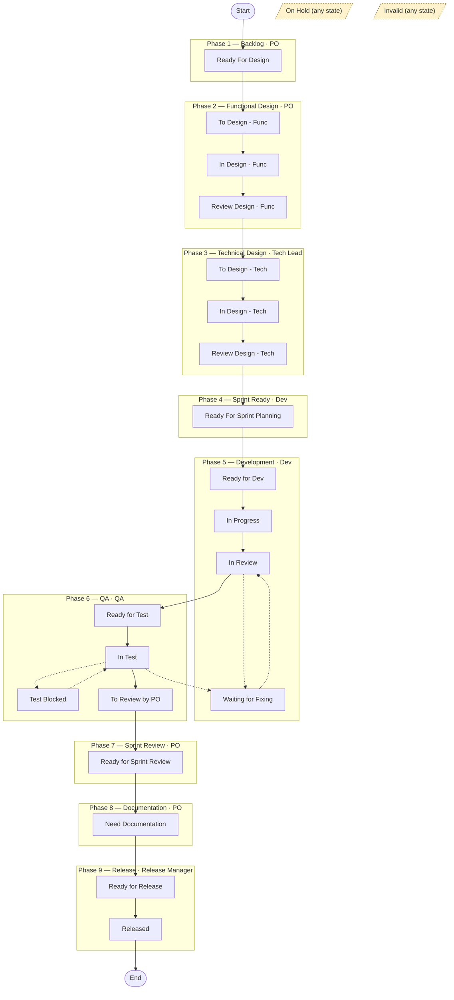

# Jira INTRD — User Stories

Reference rules for User Story issues on the INTRD project.
Read together with the main `SKILL.md`.

## Scope — functional only

Every User Story this lane authors is a **functional** story — it describes user-facing value a
PO can validate. Work whose only purpose is technical (refactor, migration, index, internal API,
infrastructure) is **not** a Story: it is an **Enabler**, which is architect-owned and split out
during Technical Design. The func/PO lane keeps Stories functional and flags technical needs;
it authors an Enabler only on explicit request. Full rule and litmus: `SKILL.md`
§ *Authoring boundary — User Stories are functional, never technical*.

## Story scope — demonstrable, not just functional

Functional (above) is necessary but **not sufficient**. Every User Story must be **both**:

- **Functional** — it expresses user or business value: the *what* and the observable
  behaviour, not a technical layer or implementation step.
- **Demonstrable** — its outcome can be shown to a stakeholder at a sprint review as an
  observable behaviour or artifact, **on its own** — independently of any other Story.

**The demonstrability test.** When authoring or reviewing a Story, apply one check: *could a PO
demo this Story's outcome on its own at a sprint review?* If the only way to show it is *through*
another Story, it is **not** an independent Story.

**Anti-pattern — horizontal (pipeline-stage) slicing.** Do not slice one capability into a Story
per technical pipeline stage. Each layer is invisible on its own and demoable only through the
Story that assembles them, so each fails the demonstrability test even when it carries no
implementation detail — it reads as "functional" but is not demonstrable.

- **Wrong** — slice by pipeline stage (select → compute → validate → write). Each layer is
  invisible alone.
- **Right** — slice **vertically**: each Story a thin end-to-end increment of observable value.

*Worked example (INTRD e-reporting / OER).* The "Generate an e-reporting file" capability was
first sliced by pipeline stage into separate Stories — *Aggregate transactions*, *Validate
against the XSD*, *Write the file to the output path*, *Determine the perimeter*, *Exclude
OSS/IOSS*. None had an observable outcome alone — you could only demo them through *Generate* —
so although they read as functional (no Java / implementation detail), they failed the
demonstrability test. Fix: re-slice vertically by folding the internal steps into the
demonstrable *Generate* Story (their rules became its acceptance) and letting the architects
create the aggregate / validate / write work as Enablers / sub-tasks underneath.

**Routing non-demonstrable work.** Technical sub-steps that are not independently demonstrable do
**not** become User Stories. They live **inside the demonstrable Story's acceptance**
(`customfield_10136`) and are realised as architect-created **Enablers / sub-tasks** during
Technical Design — see `enablers.md` § *Ownership — architect-initiated* and `SKILL.md`
§ *Authoring boundary — Technical design belongs to the architect lane*. This rule is the
**upstream complement** to those boundaries: the func/PO lane must not even *create*
technical-layer Stories in the first place.

**Reviewer expectation.** Reject a Story that is not independently demonstrable. Either **merge it
into the demonstrable Story it serves** — folding its rules into that Story's acceptance — or
**reclassify it as an Enabler**. Reclassification is never silent: Enablers are architect-owned
(`enablers.md` § *Ownership — architect-initiated*), so flag the technical need for the architect
lane rather than quietly converting it yourself.

## Naming

When a Story belongs to an Epic, its summary **must** follow the `[<epic-suffix>] (<n>) <story name>` pattern defined in [`epics.md` § Child Story naming](epics.md#child-story-naming). The suffix is chosen at Epic level and must be copied verbatim to every child Story — do not vary casing or spelling.

## Field mapping

User Stories use four custom fields **instead of** the standard `description` field:

| Field name        | Field ID            |
|-------------------|---------------------|
| Requirement       | `customfield_10134` |
| Functional design | `customfield_10135` |
| Acceptance        | `customfield_10136` |
| Technical design  | `customfield_10137` |

**The func/PO lane authors the first three fields only.** *Technical design* (`customfield_10137`) is architect-lane territory and is left as the empty template scaffold; authoring it is the architect lane's job (the `oc-ar-tech-design` skill, where available) — or, by explicit user request, here via the § *ADF recipe* below. See `SKILL.md` § *Authoring boundary — Technical design belongs to the architect lane*.

**Note on the standard `description` field.** A Story's standard `description` is normally unused in the PO field model (the four custom fields replace it). But the archi `oc-ar-ai-tech-design` skill may place an "AI-Friendly Technical Design" there. Before editing a Story, do **not** assume `description` is empty/disposable — if it holds tech-design content, treat it as architect-owned (read-only to the PO lane), the same boundary as `customfield_10137`.

In JQL, the User Story issue type is named **`Story`** (id `10001`) — not `"User Story"`.

## Field preset for full functional read

```
["summary", "status", "issuetype", "priority", "assignee", "parent", "labels", "components",
 "customfield_10134", "customfield_10135", "customfield_10136", "customfield_10137"]
```

## Templates

User Stories have **three** template variants. All three are Story-type and use the same
four custom fields (`customfield_10134`–`10137`); they differ only in the pre-filled
structure tailored to the work's discipline.

| Variant       | Template key | Use when                                                        |
|---------------|--------------|-----------------------------------------------------------------|
| Generic       | INTRD-1486   | Default — story spans backend and frontend, or is mixed/unclear |
| Backend-only  | INTRD-42531  | Story is clearly backend-only (API, rating, billing; no UI)     |
| Frontend-only | INTRD-42554  | Story is clearly frontend-only (Portal UI; no backend change)   |

Fetch the chosen template with `responseContentFormat: "adf"` to preserve panels and layouts.

**Selection rule.** When a story is *obviously* single-discipline — clearly only backend or
only frontend — do **not** silently pick a template. State your read and **ask the user**
whether to use the generic template or the matching specialized variant. When the discipline
is mixed or unclear, default to the generic template (INTRD-1486) without asking.

**Components vs template.** The `components` field (`Backend`, `Frontend`, both, or other)
remains useful metadata and must still be set on every story — independently of which
template is used. It does not *auto-select* the template; the specialized variant is offered
by the selection rule above and confirmed with the user.

## Known automation quirk — mandatory two-step creation

A Jira automation on INTRD **silently overwrites custom fields at issue creation**.

**Mandatory two-step process for User Story creation:**

1. `createJiraIssue` — create the issue with summary and issue type only
2. Immediately follow with `editJiraIssue` — set the custom fields in this second call.
   **All four fields only accept ADF** (`contentFormat: "adf"`); each value must be a full ADF document object reproducing the template's dark-red-heading + rule styling. Plain Markdown is rejected by the API with `"Operation value must be an Atlassian Document"`.
   - **Author content** for the three PO-owned fields: `customfield_10134` (Requirement), `customfield_10135` (Functional design), `customfield_10136` (Acceptance).
   - **`customfield_10137` (Technical design)** — set it to the **empty template scaffold only** (the dark-red headings, author-hint panels, and the *Limits & volumes* placeholder, with no technical-solution content filled in). Authoring this field is the architect lane's job (the `oc-ar-tech-design` skill, where available) — see `SKILL.md` § *Authoring boundary — Technical design belongs to the architect lane*. Fill it here only when the user explicitly asked you to write the technical design; otherwise defer to `oc-ar-tech-design`.

Never attempt to set custom fields inside `createJiraIssue` — they will be lost.

### ADF recipe — dark-red heading + rule (copy-pasteable)

This recipe supplies the shared ADF heading/rule/panel vocabulary and the EMPTY `customfield_10137` scaffold; the FILLED structure of `customfield_10137` is owned by the architects' `oc-ar-tech-design` (`references/adf-template.md`), where available.

Section headings are real ADF **`heading` nodes** (not styled `paragraph` nodes), with the heading text marked `strong` + `textColor` `#bf2600`, and a `rule` node immediately after each one. `#bf2600` is the func/brand heading colour; other Opencell skills (e.g. `oc-ar-ai-tech-design`) may emit `#FF0000` — keep func-authored content on `#bf2600` and do not silently normalise to another value. Use `attrs.level` to encode the hierarchy:

- **Level 1** — the field title, matching the field name verbatim: `Requirement`, `Functional design`, `Acceptance`, `Technical design`. One per field, at the top.
- **Level 2** — the main sections (`User journey & Process flow`, `GUI`, `Test cases`, `Component tree`, …).
- **Level 3 / 4** — subsections nested under a level-2 section.

Mirror the template's own structure (e.g. frontend Story template **INTRD-42554**) — every section in it is a `heading` node at the level above. Reference issue with the correct full shape: **INTRD-43398** (backend Story).

```json
{
  "type": "doc",
  "version": 1,
  "content": [
    {
      "type": "heading",
      "attrs": { "level": 1 },
      "content": [
        {
          "type": "text",
          "text": "Functional design",
          "marks": [
            { "type": "strong" },
            { "type": "textColor", "attrs": { "color": "#bf2600" } }
          ]
        }
      ]
    },
    { "type": "rule" },
    {
      "type": "heading",
      "attrs": { "level": 2 },
      "content": [
        {
          "type": "text",
          "text": "Section heading",
          "marks": [
            { "type": "strong" },
            { "type": "textColor", "attrs": { "color": "#bf2600" } }
          ]
        }
      ]
    },
    { "type": "rule" },
    {
      "type": "paragraph",
      "content": [{ "type": "text", "text": "Body content here." }]
    },
    {
      "type": "table",
      "attrs": { "isNumberColumnEnabled": false, "layout": "default" },
      "content": [
        {
          "type": "tableRow",
          "content": [
            { "type": "tableHeader", "attrs": {}, "content": [{ "type": "paragraph", "content": [{ "type": "text", "text": "Column A" }] }] },
            { "type": "tableHeader", "attrs": {}, "content": [{ "type": "paragraph", "content": [{ "type": "text", "text": "Column B" }] }] }
          ]
        },
        {
          "type": "tableRow",
          "content": [
            { "type": "tableCell", "attrs": {}, "content": [{ "type": "paragraph", "content": [{ "type": "text", "text": "Value 1" }] }] },
            { "type": "tableCell", "attrs": {}, "content": [{ "type": "paragraph", "content": [{ "type": "text", "text": "Value 2" }] }] }
          ]
        }
      ]
    }
  ]
}
```

## Limits & volumes (story-level)

Cross-cutting rule and strict-answering policy: see `SKILL.md` § *Limits & volumes — mandatory reflection*. This section is the story-specific checklist.

**Authoring boundary.** This section lives inside *Technical design* (`customfield_10137`), which the func/PO lane does **not** author — see `SKILL.md` § *Authoring boundary — Technical design belongs to the architect lane*; authoring it is the architect lane's job (the `oc-ar-tech-design` skill, where available). So on a Story the checklist below is **not this lane's to fill**: leave it as the template placeholder for the architect lane / Tech Lead, and when reviewing a Story, verify it has been answered point by point. Author it yourself only when the user explicitly asks you to write the technical design (otherwise defer to `oc-ar-tech-design`). The checklist that follows is the reference the section must satisfy — both for whoever fills it and for Claude checking it during review.

**Placement.** The limits-and-volumes content lives inside *Technical design* (`customfield_10137`), as the final sub-section, under a heading `Limits & volumes`. It comes after the rest of the technical design so it reflects the chosen approach, not a vacuum.

**Inherit from the Epic.** Before filling this section, open the parent Epic and copy the relevant envelope figures verbatim into a short *Inherited envelope* paragraph. Then answer the checklist below in terms of this story's slice of that envelope.

**Checklist.** Answer each point, or write `N/A — <one-line reason>`:

1. **Per-request volume** — for each new or modified endpoint touched by this story: typical and worst-case input size (record count, payload bytes), and the response shape & size at the worst case.
2. **Result-set size & pagination** — for any list, search, or export added or modified: default page size, maximum page size, total result-set cap, and behaviour beyond the cap (truncate / paginate / error).
3. **Concurrent users on the affected flow** — expected concurrency on the user-facing flow this story delivers, drawn from the Epic envelope. Call out any flow where contention matters (locks, optimistic concurrency, queue ordering).
4. **Latency target** — p50 / p95 target for the new or modified user action, end-to-end. State the measurement point (browser, API gateway, service).
5. **Data-volume horizon at delivery** — expected row count / storage footprint of the new or modified entity at GA, and the growth rate assumption (per day / per tenant / per active user). Distinguish "right after release" from "12 months after release".
6. **Degradation behaviour** — what the user sees when a limit above is hit: clear error, soft truncation, graceful fallback, queueing. Silent failure is never acceptable.
7. **Telemetry hooks** — which metrics / logs / traces let us observe each of the above in production. If observability is deferred, link to the follow-up issue.

**Reviewer expectation.** A story whose technical design ends with seven `N/A — ...` lines is suspect: at minimum, latency target, data-volume horizon, and degradation behaviour are almost always applicable for any story that touches a backend flow or a non-trivial UI list.

## Information requirements — naming decided model bindings

Cross-cutting principle and the bounded-exception framing: see `SKILL.md` § *Decided model bindings
— name the conceptual home in the functional design*. This section is the Story-level mechanics.

The *Information requirements* of *Functional design* (`customfield_10135`) lists the information a
Story needs **in business terms**. **Default:** we don't directly name database/model properties —
we list the information (e.g. "the customer's VAT regime"), and the architect decides where it
lives. Most Stories stay here.

**Bounded exception — already-decided model element.** When a model decision is **already fixed**
(e.g. settled in design) and the architect must respect it, name the conceptual entity/attribute
here — mirror the live generic template (INTRD-1486) wording verbatim:

> When a model decision is ALREADY fixed (e.g. settled in design) and the architect must respect it,
> name the conceptual entity/attribute here (e.g. `EreportingSetting.vatRegime`). Stay conceptual —
> the physical design (tables, JPA mappings, indexes) belongs in Technical design.

This is the exception for ALREADY-DECIDED elements, **not** a reversal of the default — a Story with
no settled model decision still just lists information.

**The *Held on (conceptual model)* column.** The home for the binding is the optional
*Held on (conceptual model)* column on the *Information requirements* table. Per row, name
`entity.attribute` + a one-line decided-input / why + the decision source (ADR / spec). Leave it
empty for rows whose model home isn't decided yet.

**Reference the Epic, don't duplicate it.** When the parent Epic carries a *Domain model & decided
design inputs* section (`epics.md` § *Domain model & decided design inputs*), the Story names only
**its slice** and references the Epic — the shared model is defined once on the Epic, not copied into
every Story.

**Template coverage.** The generic (INTRD-1486) and backend (INTRD-42531) Story templates carry this
clause and the *Held on* column. The frontend template (INTRD-42554) intentionally does **not** — it
has no *Information requirements* section and defers data-model concerns to its paired backend Story.

**Reviewer expectation.** When a decided model element exists for a Story's data, reject an
*Information requirements* section that names the user-facing information but omits its conceptual home.

## GUI labels — bilingual (EN + FR)

> **Designing the screen (not just describing it).** When a Story has GUI impact, the *GUI* section
> should carry an **actual design** — real Design-System components, tokens, a screenshot, and a
> Figma link — not prose that leaves the screen for a developer to invent. Producing that design is
> the **`oc-fn-gui-design`** skill's job (it reads the Opencell Figma design system — MUI v6 — in the
> same Phase-2 lane). This lane still owns **writing** the design into the Story: the ADF, the
> bilingual labels below, and the inline-media safety rule for the screenshot (see `SKILL.md`
> § *Destructive edits on fields containing inline media*). `oc-fn-gui-design` produces the artifacts
> (link + dated screenshot + grounded spec) and hands them here.

When a Story has a real GUI (the *GUI* section is **not** `N/A`), every user-facing label must be given in **both English and French** — field labels, **enum / selector values**, buttons, tab and section titles, and actions. The clean form is a bilingual table under *Descriptions and mockups*:

| Element | Label (EN) | Label (FR) |
|---|---|---|

This is already mandated by the generic Story template (INTRD-1486 — *"All labels must have both English and French translations"*) but is easy to miss at authoring time, so it is an explicit rule here. It complements the *User-facing messages & edge cases* table, which already requires EN + FR.

- **Enums** — the **code stays English** (e.g. `NON_TAXABLE_PERSON`); give **both** display labels — EN "Non-taxable person" / FR "Non-assujetti". The French regulatory term belongs in the FR label, never in English prose.
- **Proper French regulatory names** (VAT-regime names: *réel normal mensuel*, *franchise en base*, …) are identical in both columns — note that rather than inventing a translation.
- **Backend-only Stories** with no Portal surface keep `GUI = N/A — <reason>` and are exempt.

**Reviewer expectation.** Reject a Story whose GUI section lists any user-facing label in only one language.

## Acceptance tests

Detailed rules for filling `customfield_10136` (*Acceptance*) live in
`stories-acceptance.md`. Read that file whenever the user asks Claude to
write, refine, or review acceptance tests.

It carries, among other things, the **hard precondition that the Functional
design must be solid before any test is written** — when the FD has gross
holes (missing sections, empty mandatory tables, vague rules, missing
user-facing messages), Claude must refuse to generate tests and list the
holes back to the PO instead of papering over them.

## Workflow

User Stories on INTRD follow a 9-phase workflow. Each phase groups one or several
Jira statuses and has a single accountable role. Roles in use: **PO**, **Tech Lead**,
**Dev**, **QA**, **Release Manager**.

### Phases

| # | Phase                | Statuses                                                                                                      | Responsible                          |
|---|----------------------|---------------------------------------------------------------------------------------------------------------|--------------------------------------|
| 1 | Backlog / Created    | Ready For Design                                                                                              | PO                                   |
| 2 | Functional Design    | To Design - Func → In Design - Func → Review Design - Func                                                    | PO                                   |
| 3 | Technical Design     | To Design - Tech → In Design - Tech → Review Design - Tech                                                    | Tech Lead                            |
| 4 | Sprint Ready         | Ready For Sprint Planning                                                                                     | Dev *(Dev Leads evaluate the load)*  |
| 5 | Development          | Ready for Dev → Need Sync (Before Dev) → In Progress → In Review → Need Sync (After Dev) → Waiting for Fixing | Dev                                  |
| 6 | QA                   | Ready for Test → In Test → Test Blocked → To Review by PO *(pre-validation before sprint review)*             | QA                                   |
| 7 | Sprint Review        | Ready for Sprint Review                                                                                       | PO                                   |
| 8 | Documentation        | Need Documentation *(written after US validation)*                                                            | PO                                   |
| 9 | Release              | Ready for Release → Released                                                                                  | Release Manager                      |

### Side states

| Status   | Meaning                                                                                              |
|----------|------------------------------------------------------------------------------------------------------|
| On Hold  | Story paused, not to be processed until further notice. The reason **must** be written in a comment. |
| Invalid  | Story closed without delivery (cannot be reproduced, unclear, abandoned).                            |

### Notes on the workflow

- **Phase 2 (Functional Design)** does *not* include `To Review by PO`. That status lives at the end of QA, as a pre-validation before the sprint review.
- **Phase 4 (Sprint Ready)** is owned by Dev — concretely, Dev Leads evaluate the load on each US before sprint planning.
- **Phase 6 (QA)** ends with `To Review by PO`, a pre-validation of the delivered work before the sprint review.
- **Phase 8 (Documentation)** runs *after* the PO sprint-review validation, not before.
- The full Jira workflow diagram (with all valid transitions) is the source of truth — refer to it in Jira when in doubt about a specific transition.

### Workflow diagram (happy path)

Solid arrows = nominal flow. Dashed arrows = return loops (fix or unblock).


